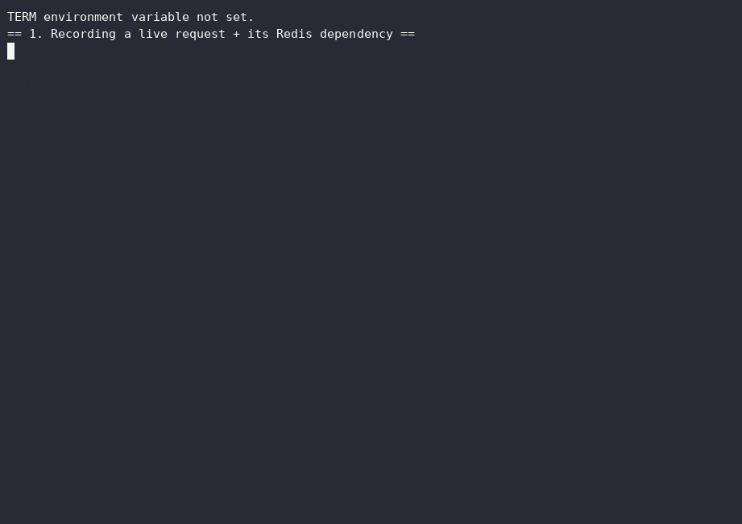
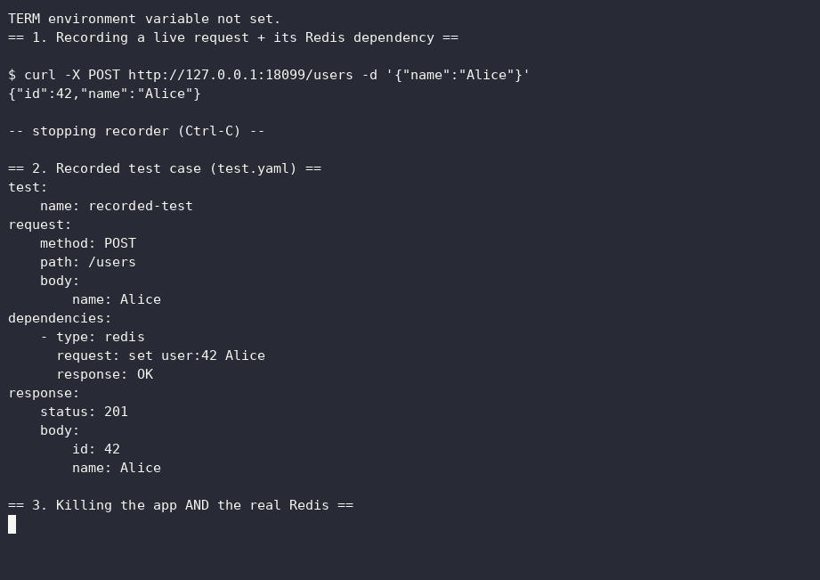
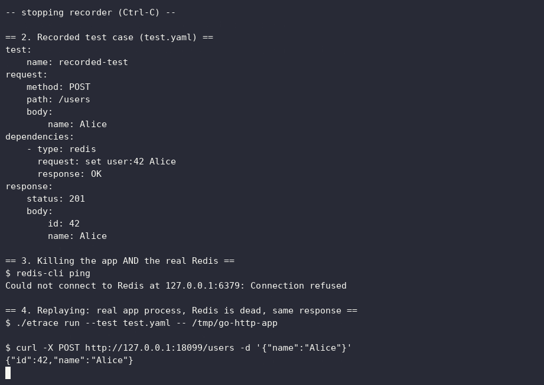

# Wiremark

[](https://github.com/VidhuSarwal/wiremark/releases)
[](go.mod)
[](LICENSE)
[](#development)

**See what your app actually talked to.**

Record a real HTTP request and the Redis calls behind it. Replay the same interaction later — without Redis running.

```bash
curl wiremark.vidhux.dev/install | sh
```

Wiremark watches a running process from inside the Linux kernel, captures the traffic it actually sends and receives, and turns a real HTTP interaction plus its Redis calls into a replayable test fixture.


New to eBPF, syscalls, or this project generally? [`GUIDE.md`](GUIDE.md) explains everything from scratch, in plain language, before you read the reference below.

The idea is simple:

```text
             RECORD

   your app + real Redis
           │
           │ real traffic
           ▼
      Linux + eBPF
           │
           ▼
     recorded.yaml
           │
           │ REPLAY
           ▼
   your app + replay proxy
           │
           └── Redis can be OFF
```

Your application still makes the same Redis calls. It just gets the recorded replies instead of talking to a live Redis instance.

No test-only client code. No application SDK. No "please route this through our proxy" configuration.

The interesting part is that Wiremark does not sit in front of the application as a network proxy while recording. It watches the process at the syscall boundary using eBPF.

> **Current focus:** one concrete workflow, done well: record one HTTP request and its Redis dependencies, then replay that interaction without Redis.
>
> Wiremark is intentionally **not** a general-purpose packet capture system, service virtualization platform, or full network replay suite.

---

## Why this exists

A test can be perfectly deterministic and still be annoying to run.

Maybe the application needs Redis. Maybe CI has to start a database before the test. Maybe the test only exercises one very specific interaction, but you still have to recreate enough infrastructure to make that interaction happen.

Mocks solve part of this, but they introduce another problem: somebody has to write the mock, keep it in sync, and decide what the dependency should have returned.

Wiremark takes a narrower approach:

1. Run the application against the real dependency once.
2. Record what actually happened.
3. Save that interaction as a small, human-readable fixture.
4. Run the application later with the recorded dependency responses.

The fixture becomes the thing the test depends on.

That does **not** mean real integration tests are obsolete. They are not. Wiremark is for the layer in between: tests that want realistic dependency behavior without requiring the dependency to be alive every time.

---

## The part that makes Wiremark different

Wiremark records traffic without asking the application to participate.

For ordinary tracing, it attaches eBPF tracepoints to `connect`, `read`, `write`, and `close`, scoped in the kernel to the target PID.

That gives it a view of what the process actually did rather than what an application-level SDK says it did.

The captured bytes are then passed through protocol decoders. Right now the useful v1 path is:

```text
Linux syscall traffic
        │
        ├── HTTP
        │
        └── Redis / RESP2
```

For supported OpenSSL applications, `--tls` can additionally observe plaintext at the TLS library boundary, before the data is encrypted or after it has been decrypted.

The implementation detail matters because it enables the workflow. It is not the product by itself.

---

## What you can do today

### Watch a process live

```bash
sudo ./wiremark trace --pid <pid>
```

You get a live terminal view of the traced process's network activity.

For plain text output:

```bash
sudo ./wiremark trace --pid <pid> --no-tui
```

### Record an interaction

```bash
sudo ./wiremark record --pid <pid> -o test.yaml
```

Wiremark watches the process until you stop the recording, then writes a test case containing the HTTP request/response it decoded and the Redis interactions it found.

### Replay it with Redis turned off

```bash
./wiremark run --test test.yaml -- ./your-app
```

The replay side starts a small userspace RESP2 proxy for the recorded Redis interactions and points the launched application at it through `REDIS_ADDR`.

No eBPF is involved during replay and no root is required.

So the useful demo is literally:

```text
1. Run app + Redis
2. Record one real request
3. Stop Redis
4. Replay the recording
5. The app still gets the recorded Redis replies
```

That is the whole point.

---

## A recording is meant to be readable

A recording is YAML, not an opaque binary trace:

```yaml
test:
  name: recorded-test

request:
  method: POST
  path: /users
  body:
    name: Alice

dependencies:
  - type: redis
    request: set user:42 Alice
    response: OK

response:
  status: 201
  body:
    id: 42
    name: Alice
```

You can open the file and understand the interaction without decoding a packet dump:

> `POST /users` caused `SET user:42 Alice`, Redis replied `OK`, and the application returned `201`.

That makes the recording usable as a test fixture, not just as debugging output.

---

## Why not just use a mock?

Sometimes you should.

Wiremark is useful when the easiest way to define the mock is to let the real system generate it.

Instead of writing:

```text
"when SET user:42 happens, return OK"
```

you can run the real interaction once and capture the answer the application actually received.

That is especially useful when the dependency interaction is easy to observe but tedious to reproduce by hand.

---

## Why not use a proxy?

A proxy changes the path the application uses to communicate.

Wiremark's recording path does not require that.

The application keeps using its normal networking code. Wiremark watches the process from the kernel.

That means there is no application SDK and no requirement to teach the application about Wiremark just to get a recording.

---

## Why not just run Redis in CI?

You still can.

Wiremark is not trying to replace integration tests against real infrastructure.

A good test suite can have all three:

```text
unit tests
    │
    ▼
recorded / replayed tests
    │
    ▼
real integration tests
```

The recorded layer is useful when bringing up the real dependency adds cost without adding useful coverage for that particular test.

---

## One-minute demo

The repository includes a small HTTP example used for the end-to-end path.

A typical flow looks like this:

```bash
# Build
make build

# Start your application
./examples/go-http-app &
APP_PID=$!

# Watch it
sudo ./wiremark trace --pid $APP_PID

# In another terminal, exercise the app
curl http://127.0.0.1:18099/medium
```

For the actual record/replay workflow:

```bash
# Record one interaction while Redis is running
sudo ./wiremark record --pid $APP_PID -o test.yaml

# Stop the real Redis
redis-cli shutdown nosave

# Run the application using the recording
./wiremark run --test test.yaml -- ./examples/go-http-app
```

Then send the same request again.

The application still connects to Redis. It just reaches Wiremark's replay proxy instead of a real Redis server.



<details>
<summary>See it recorded, Redis killed, and replayed (stills)</summary>

<br>

Redis is stopped and the recording is played back:



The application runs again against the recording, no live Redis required:



</details>

---

## Live tracing

The tracer has three views in the TUI:

### Events

The raw event stream: syscall activity and, with `--tls`, OpenSSL plaintext events.

### Connections

Connections assembled from the observed socket activity, including the remote endpoint and cumulative bytes in/out.

### HTTP

Decoded HTTP request/response exchanges with method, path, status, body preview, and truncation state.

There is also a convenience launcher:

```bash
./wiremark launch
```

It lets you choose the mode and target without remembering every flag.

---

## HTTPS and TLS

For programs that use OpenSSL directly:

```bash
sudo ./wiremark trace --pid <pid> --tls
```

The TLS probes attach to `SSL_write` / `SSL_read` in the traced process's own loaded libssl and capture plaintext at the TLS boundary.

That means the technique can see HTTP plaintext even when the network connection itself is encrypted.

There is an important limitation: Go's standard `crypto/tls` implementation does not use OpenSSL, so this mode does not currently expose plaintext from a Go program using its normal TLS stack.

`--tls` is also deliberately small in v1. The current implementation targets the plain `SSL_write` / `SSL_read` symbols rather than every possible libssl entry point.

---

## How it works

At the implementation level, Wiremark is split into a few small stages:

```text
eBPF
  │
  ▼
collector
  │
  ├──────────────► printer
  │
  ▼
correlator
  │
  ▼
streamer
  │
  ├──────────────► TUI
  │
  ▼
decoder
  │
  ├── HTTP
  └── RESP2
        │
        ▼
     recorder
        │
        ▼
      YAML
        │
        ▼
      replay
```

The important boundary is between capture and interpretation.

The eBPF collector does not need to know what HTTP or Redis means. It produces events.

The decoder works on byte slices and understands protocol semantics.

The recorder turns decoded exchanges into a test-case-shaped document.

The replay side reads that same document and provides the recorded dependency responses.

That separation is also what keeps most of the code testable without running a live eBPF program.

---

## A few implementation details that matter

### Reads are not writes

A `write()` already has the user's buffer populated when the syscall begins.

A `read()` does not. The kernel fills the destination buffer and only then returns.

So `read()` capture uses an entry/exit pair:

```text
sys_enter_read
    │
    └── remember buffer + fd
            │
            ▼
sys_exit_read
    │
    └── read the returned bytes
```

This distinction matters in an actual tracer; treating both syscalls the same produces garbage.

### File descriptors get reused

A connection is not identified only by `(pid, fd)`.

Linux can close fd 7 and later reuse fd 7 for an entirely different socket. Wiremark assigns a monotonic connection sequence so those lifecycles do not get accidentally merged.

### Redis connections do not necessarily close

Real Redis clients commonly pool connections.

That means "decode everything when `close()` happens" is not enough.

Wiremark flushes buffered connections when the trace ends as well, so pooled Redis traffic can still become a recording.

These are not theoretical edge cases. They are the kinds of behaviors that changed the implementation.

---

## Security and sensitive data

**Recordings can contain real application data.**

Depending on what the traced process is doing, a recording can contain:

- request bodies
- credentials
- session tokens
- Redis keys and values
- internal service data
- plaintext captured at the TLS boundary

Treat recording files as sensitive test artifacts.

Do not commit real production recordings without reviewing and redacting them first.

Also remember that loading eBPF requires elevated privileges. `sudo` is the permission gate used by the current CLI; the eBPF verifier is still responsible for checking the loaded program before the kernel runs it.

---

## Current limitations

Wiremark is intentionally honest about what v1 does not do yet.

- Only IPv4 `connect()` addresses are currently decoded.
- Payload content is capped at 4096 bytes per syscall event. Byte counters remain based on the true syscall length.
- The tracer currently observes `connect`, `read`, `write`, and `close`; it does not yet cover every equivalent socket API such as `send`, `recv`, or `accept`.
- The connection view therefore mainly represents sockets established by the traced process itself. The HTTP decoder is broader because it works from observed bytes rather than requiring `accept()` tracking.
- Per-connection streaming is currently bounded to 64 KB per direction.
- v1 recording is intentionally scoped to a single HTTP interaction.
- Redis decoding currently targets RESP2.
- Replay matches recorded Redis commands exactly (case-insensitive), rather than parameterizing them.
- A recording started in the middle of an existing connection may not have enough bytes to decode the exchange.
- TLS capture currently targets the plain `SSL_write` / `SSL_read` symbols. `_ex` variants are not yet covered.
- TLS connections do not currently have their own close probe, so their decoded form depends on the end-of-trace flush.

These limits are part of the current design, not hidden footnotes.

---

## What this is not

Wiremark is not:

- a packet sniffer for an entire machine
- a service mesh
- a general-purpose HTTP mock server
- a drop-in replacement for integration testing
- a production traffic recorder
- a claim that every protocol can be reconstructed perfectly from syscalls

The project is deliberately smaller than that.

The useful question is:

> **Can a real interaction be captured once and made cheap and reproducible to run again?**

For the current HTTP + Redis workflow, that is what Wiremark is trying to do.

---

## Roadmap

The next steps are driven by actual gaps in the current workflow rather than by a checklist of technologies.

Possible follow-ons include:

- response diffing so a replay can tell you exactly what changed
- broader protocol support, including PostgreSQL
- container/cgroup-aware tracing
- better connection/request boundaries for pooled and long-lived connections
- more complete TLS coverage
- eventually, deeper kernel-side redirection for replay

The order matters less than keeping the core workflow useful.

---

## Development

### Requirements

Current development requires:

- Go 1.25+
- clang / LLVM
- `libbpf-dev`
- `bpftool`
- kernel BTF available at `/sys/kernel/btf/vmlinux`

Generate the kernel headers:

```bash
bpftool btf dump file /sys/kernel/btf/vmlinux format c > bpf/vmlinux.h
```

Build:

```bash
make build
```

Run the test suite:

```bash
make test
```

Most tests do not require root. Only the tests that exercise the live eBPF side need the appropriate kernel privileges.

---

## License

Apache License 2.0 — see [LICENSE](LICENSE).
